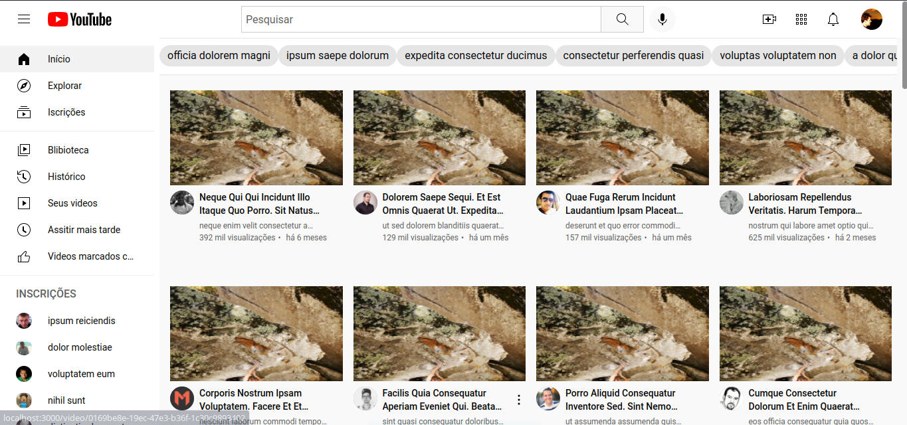
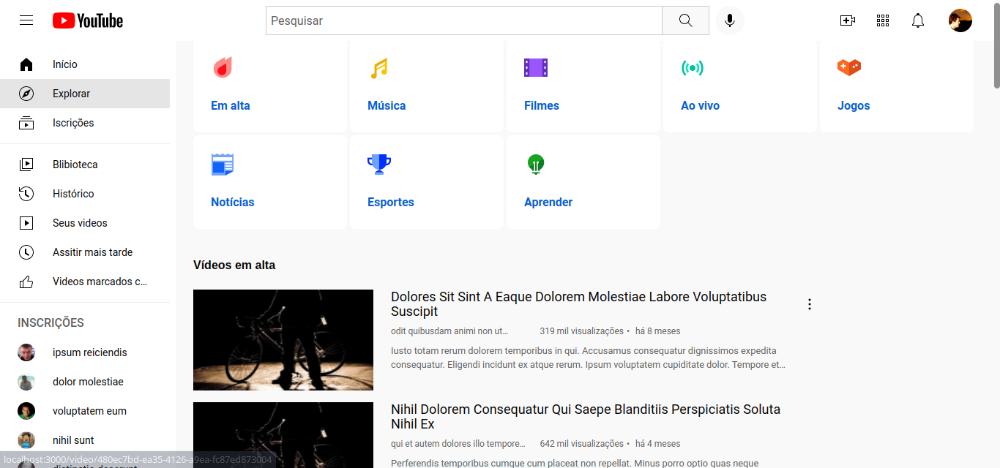
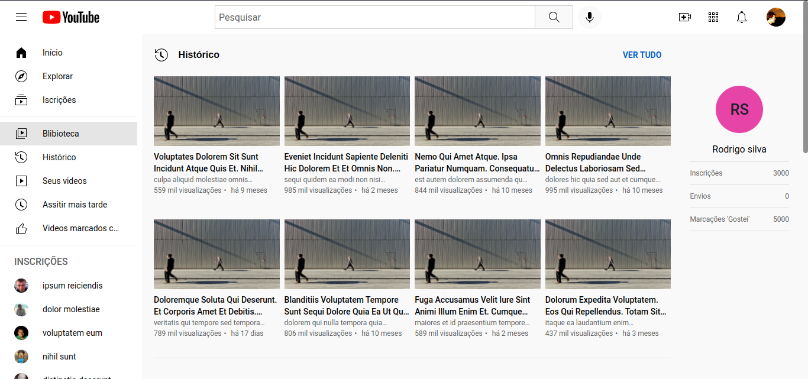
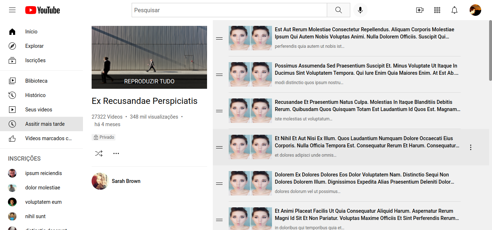
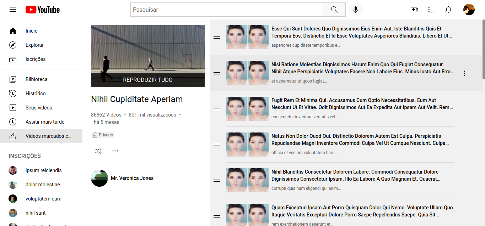
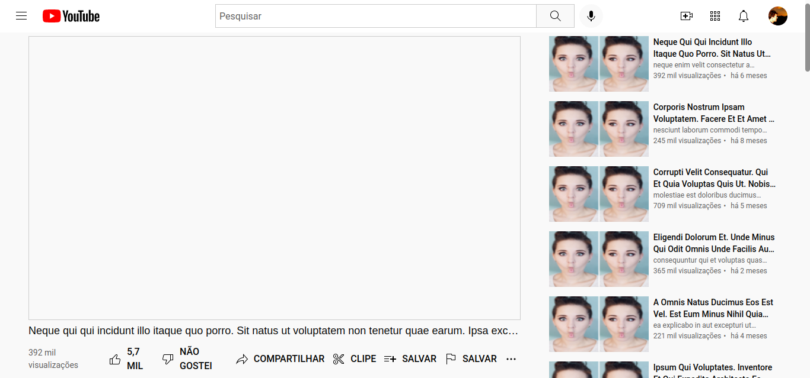

# Youtube Clone
ma implementação das páginas principais do site do YouTube com react e Redux.

## Tecnologias usadas neste projeto

- [React](https://pt-br.reactjs.org/)
- [Redux](https://redux.js.org/)
- [Chakra-ui](https://chakra-ui.com/)
- [Framer motion](https://www.framer.com/motion/)
- [react router v6](https://reactrouter.com/docs/en/v6/getting-started/overview)

## Pages

- Home 
  

- Explorar
  

- Biblioteca
  

- Assistir mais tarde
  

- Videos marcados como gostei
  

- Pagina do video
  